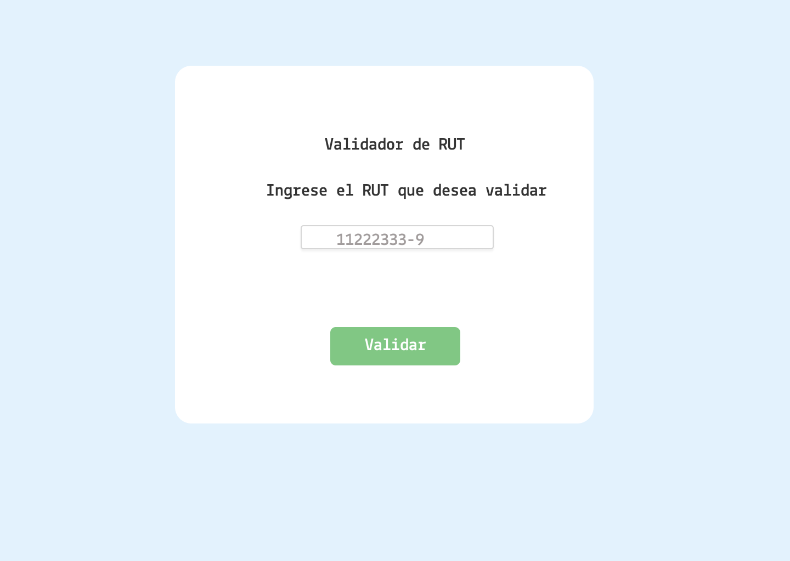
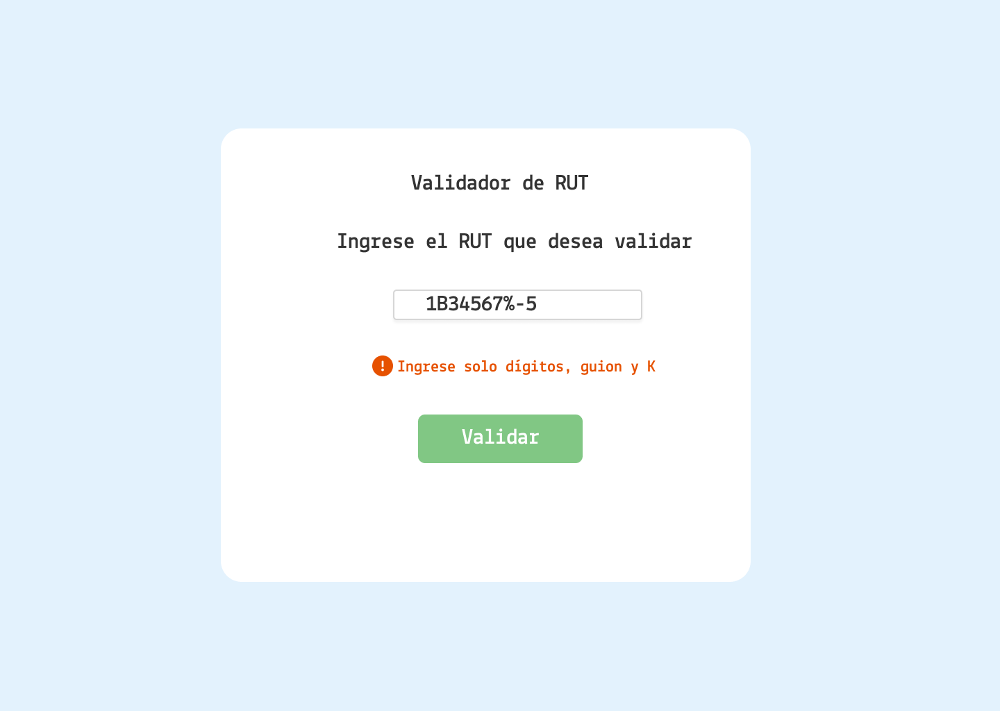
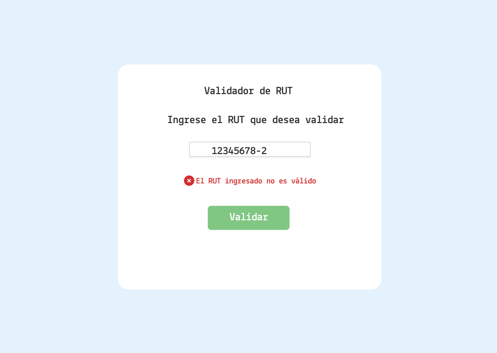
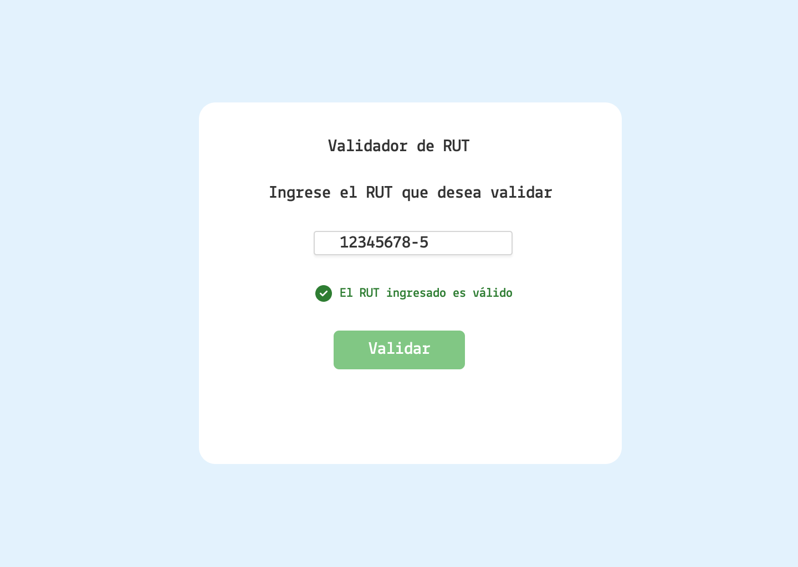
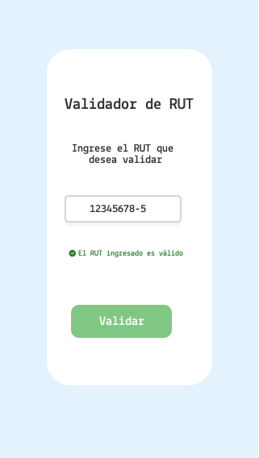
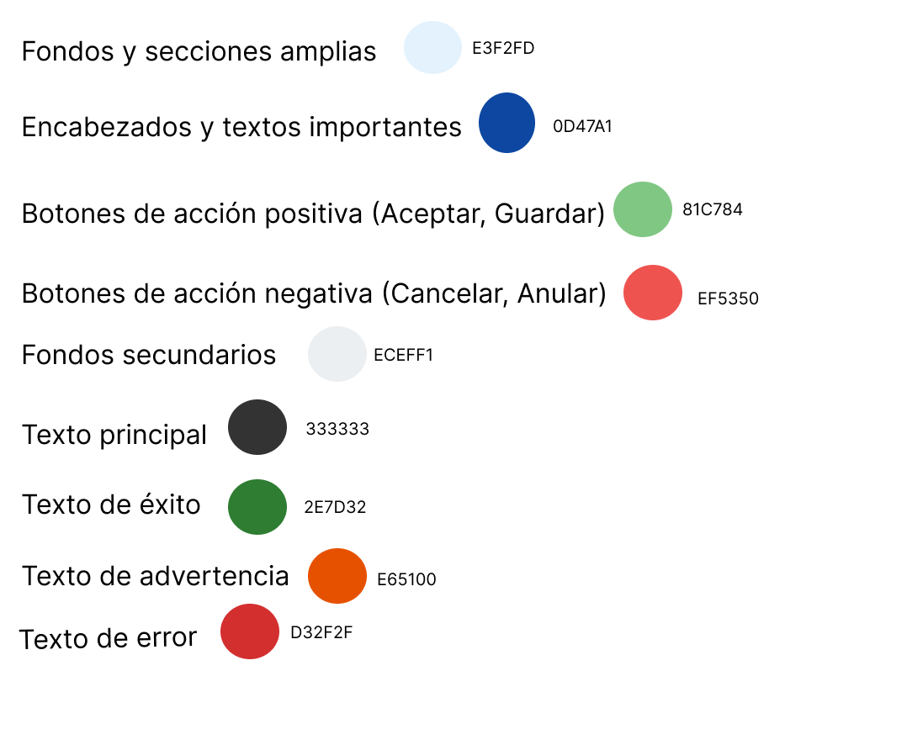
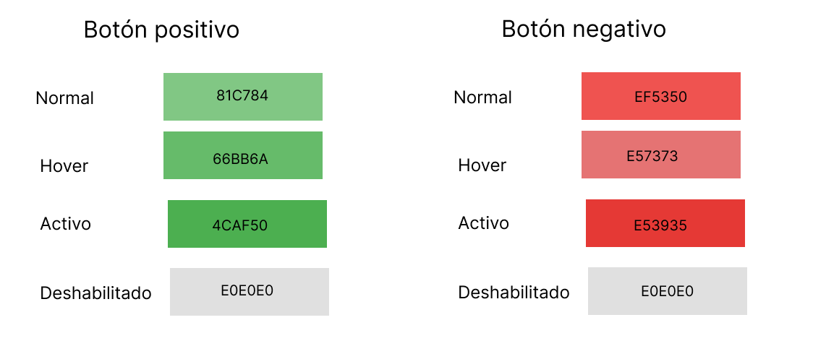

# Diseños de interfaz de usuario

## Introducción
Este documento presenta los diseños de la interfaz de usuario para la aplicación de validación de RUT, tanto en versión de escritorio como en versión móvil.  La aplicación está diseñada para mejorar la precisión y eficiencia del ingreso de datos en sistemas clínicos, minimizando errores comunes en la entrada de RUT de pacientes.

## Justificación del Diseño
La paleta de colores seleccionada para la interfaz de usuario se ha elegido cuidadosamente para alinear con el entorno clínico y mejorar la experiencia del usuario:

- Verde (#66BB6A): Utilizado para botones de acción positiva (Aceptar, Guardar) y mensajes de éxito, transmite calma y seguridad, indicando que la acción realizada fue correcta.
- Rojo (#E53935): Empleado para botones de acción negativa (Cancelar, Anular) y mensajes de error, alerta al usuario de la necesidad de corregir un dato o reconsiderar una acción.
- Naranja (#FB8C00): Utilizado para mensajes de advertencia, atrae la atención sin ser tan alarmante como el rojo, sugiriendo al usuario que hay algo que debe ser revisado.

## Versión de Escritorio

### Página de Inicio

### Ingreso de caracteres no permitidos

### RUT  no válido

### RUT válido

## Versión Móvil

### RUT válido

## Detalles Adicionales
- **Colores**: 
- **Botones**: 
- **Fuente**: La tipografía utilizada en el diseño es Lekton Bold.